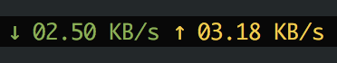

# tmux-macos-network-speed

Tmux plugin to monitor network stats on macOS. Inspired by https://github.com/tmux-plugins/tmux-net-speed

## Installation with [Tmux Plugin Manager](https://github.com/tmux-plugins/tpm)

Add this to `.tmux.conf`:
```
set -g @plugin 'minhdanh/tmux-macos-network-speed'
```

Also add `#{network_speed}` to your left/right status bar.
For example:

```
set -g status-right '#{prefix_highlight} #{network_speed} | CPU: #{cpu_icon}#{cpu_percentage} | %a %Y-%m-%d %H:%M'
```

Then hit `<prefix> + I` to install the plugin.

Sample output:



## Options

In case you want to monitor a network interface other than `en0`, set `macos_network_speed_interface` to the name of that network interface.

```
set -g @macos_network_speed_interface 'en1'
```

Colors for download and upload are supported:

```
set -g @macos_network_speed_download_color '#[fg=green]'
set -g @macos_network_speed_upload_color '#[fg=yellow]'
```
